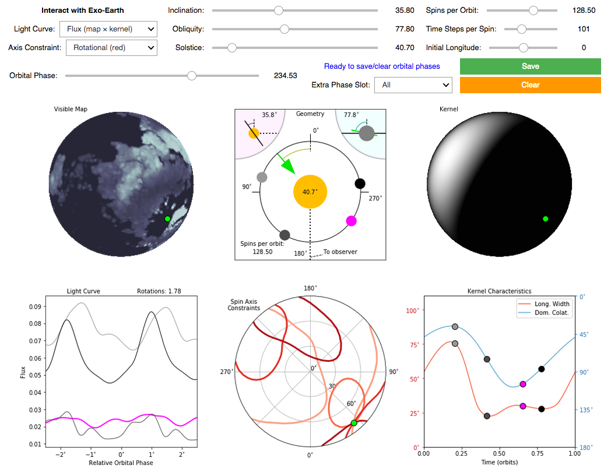

ReflectDirect
=============

**Your Jupyter stage for reflected light from directly imaged planets**

ReflectDirect is a Python suite created to explore exoplanetary systems in Jupyter notebooks. Design a planet's look and layout, view it close up or observe it from afar, examine where light strikes it and more. The code is well documented, and there's a demo notebook to get you started.

Documentation
-------------

Check out the `ReflectDirect API
<https://joelcolinschwartz.github.io/ReflectDirect/>`_ for all the details.

Info
----

Based on the model, equations and discussion of `Schwartz et al. (2016) <https://doi.org/10.1093/mnras/stw068>`_, also available `on arXiv <https://arxiv.org/abs/1511.05152>`_.

For even more background, visit `The Exo-Cartography Inverse Problem <http://www.issibern.ch/teams/exocartoinverse/>`_, the science collaboration that inspired this project.

License
-------

Copyright 2017-2021 Joel Colin Schwartz

ReflectDirect is free software made available under the MIT License. See the LICENSE file for details.